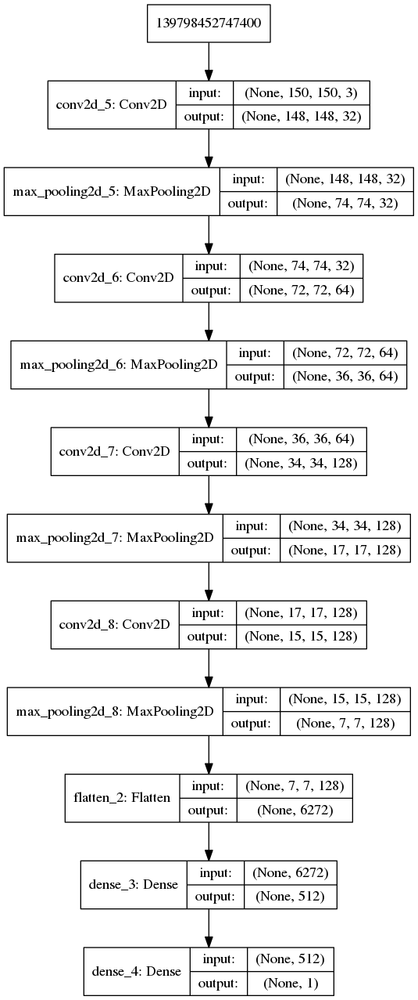
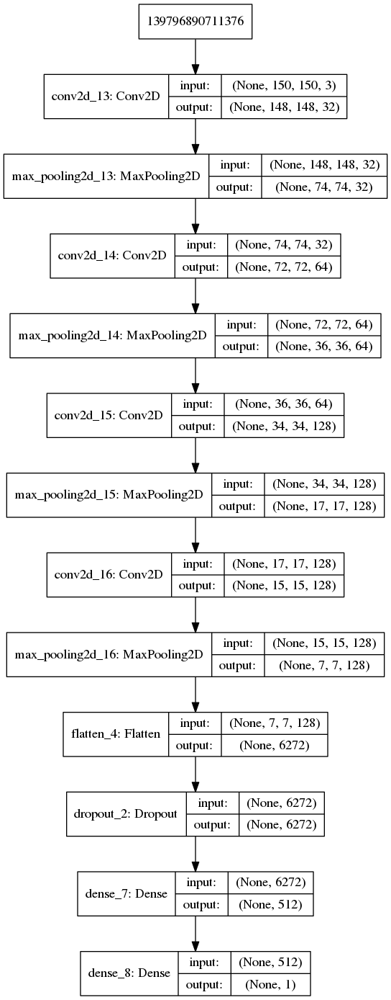

# Classyfying Dog-vs-Cat images

Following chapter 5.2 from the book Deep Learning with Python from Francois Chollet
we implement a convnet from scratch for predicting whether an image is a Cat or a Dog.

## Net architecture for Classyfying Dog-vs-Cat without dropout and data augmentation

## Net architecture for Classyfying Dog-vs-Cat using dropout and data augmentation

